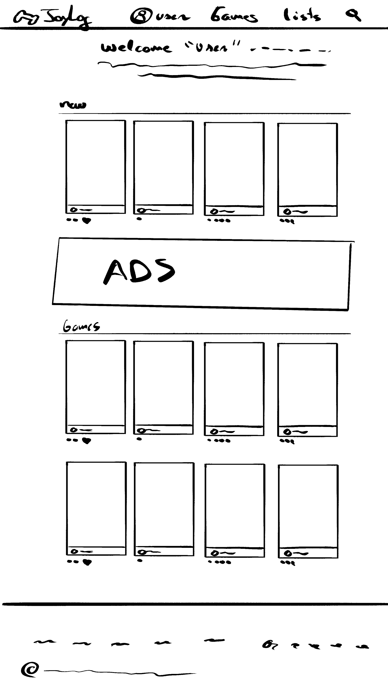
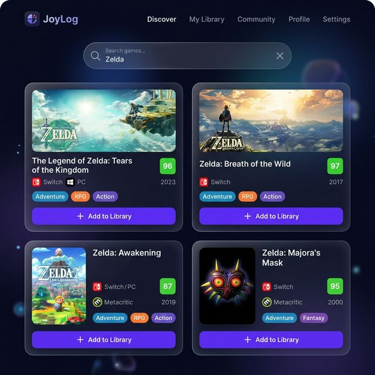
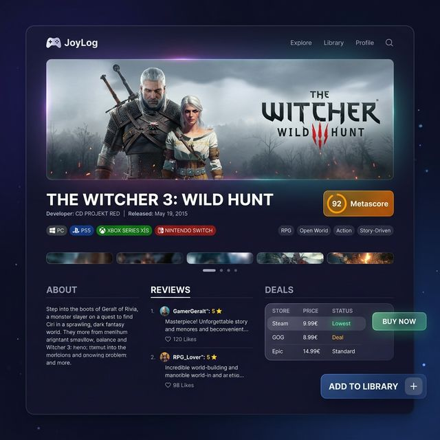
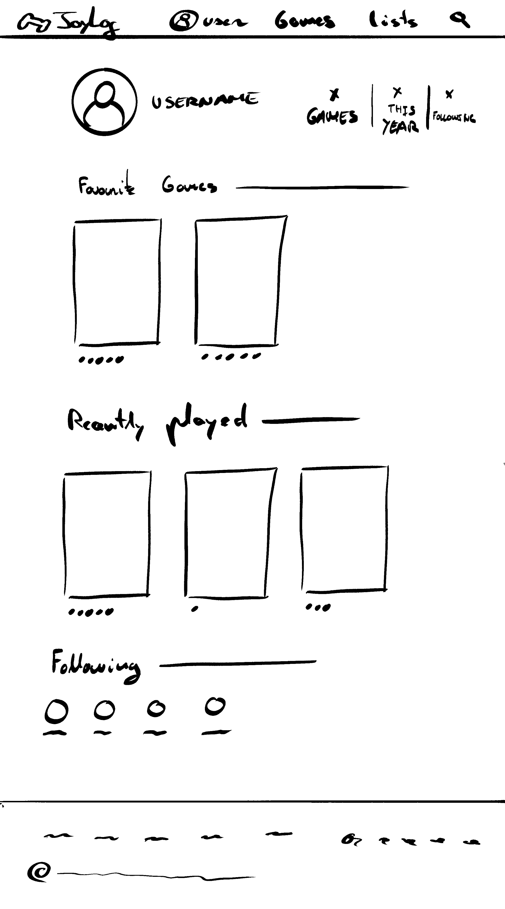

# JoyLog – Sprint 2

## 1. Listado de Requisitos

Ver documento completo: [Agent.md](Agent.md)

Resumen: 38 requisitos funcionales y 10 no funcionales organizados en categorías: Autenticación, Biblioteca, Búsqueda, Filtros, Reseñas, Ofertas, Social y Estadísticas.

---

## 2. Arquitectura Global

### Diagrama de Arquitectura

```
[Arquitectura](mockups/Arquitectura_JoyLog.png)
```

### Flujo de datos principal

1. El usuario busca un juego → Frontend envía request a `/api/search?q=nombre`
2. Backend consulta RAWG API, cachea resultado, devuelve JSON al Frontend
3. El usuario añade el juego a su biblioteca → POST `/api/games` con datos del juego
4. Backend guarda en MongoDB el `GameEntry` vinculado al `User`
5. El usuario ve ofertas → GET `/api/deals/:gameId` → Backend consulta IsThereAnyDeal API

---

## 3. Tecnologías a Usar

| Capa | Tecnología | Justificación |
|------|-----------|---------------|
| **Frontend** | React 18 + Vite | SPA moderna, rápida, amplio ecosistema |
| **Routing** | React Router v6 | Navegación SPA estándar |
| **HTTP Client** | Axios | Manejo limpio de peticiones HTTP y errores |
| **Estilos** | CSS Modules + Framer Motion | Estilos aislados + animaciones fluidas |
| **Backend** | Node.js 20 + Express 4 | API REST rápida, rico ecosistema npm |
| **ODM** | Mongoose 8 | Esquemas tipados para MongoDB |
| **Base de datos** | MongoDB Atlas | NoSQL flexible, tier gratuito, cloud |
| **Auth** | JWT + bcrypt | Autenticación stateless y hash seguro |
| **API Juegos** | RAWG API | +500k juegos, datos completos, gratuita |
| **API Precios** | IsThereAnyDeal API | Precios de PC en múltiples tiendas |
| **Testing** | Vitest + Jest | Testing unitario frontend y backend |
| **Deploy Frontend** | Vercel | Deploy automático con GitHub |
| **Deploy Backend** | Railway | Servidor Node.js en la nube |

---

## 4. Interfaces y Estructuras de Datos

Ver implementación completa en: [prototypes/interfaces.ts](prototypes/interfaces.ts)

### Modelo User
```typescript
interface User {
  _id: string;
  username: string;
  email: string;
  password: string;       // Hasheada con bcrypt
  avatar: string;
  bio: string;
  following: string[];    // IDs de usuarios
  followers: string[];
  badges: string[];
  createdAt: Date;
}
```

### Modelo GameEntry (Juego en biblioteca del usuario)
```typescript
interface GameEntry {
  _id: string;
  userId: string;
  rawgId: number;         // ID del juego en RAWG
  title: string;
  coverImage: string;
  platform: 'PC' | 'PS5' | 'PS4' | 'Xbox' | 'Switch' | 'Mobile';
  status: 'playing' | 'completed' | 'pending' | 'abandoned' | '100%';
  hoursPlayed: number;
  personalRating: number; // 1-10
  startDate: Date | null;
  endDate: Date | null;
  createdAt: Date;
}
```

### Modelo Game (Caché de RAWG)
```typescript
interface Game {
  _id: string;
  rawgId: number;
  title: string;
  description: string;
  coverImage: string;
  genres: string[];
  platforms: string[];
  metacritic: number | null;
  releaseDate: string;
  screenshots: string[];
  cachedAt: Date;
}
```

### Modelo Review
```typescript
interface Review {
  _id: string;
  userId: string;
  rawgId: number;
  title: string;
  content: string;
  rating: number;         // 1-10
  likes: string[];        // IDs de usuarios que dieron like
  createdAt: Date;
  updatedAt: Date;
}
```

### Endpoints API REST

| Método | Ruta | Descripción |
|--------|------|-------------|
| POST | `/api/auth/register` | Registrar usuario |
| POST | `/api/auth/login` | Login, devuelve JWT |
| GET | `/api/auth/me` | Perfil del usuario autenticado |
| PUT | `/api/auth/me` | Actualizar perfil |
| GET | `/api/search?q=nombre` | Buscar juegos (RAWG) |
| GET | `/api/search/:rawgId` | Ficha detallada de juego |
| GET | `/api/games` | Biblioteca del usuario |
| POST | `/api/games` | Añadir juego a biblioteca |
| PUT | `/api/games/:id` | Actualizar entrada |
| DELETE | `/api/games/:id` | Eliminar de biblioteca |
| GET | `/api/reviews/game/:rawgId` | Reseñas de un juego |
| POST | `/api/reviews` | Crear reseña |
| PUT | `/api/reviews/:id` | Editar reseña |
| DELETE | `/api/reviews/:id` | Eliminar reseña |
| POST | `/api/reviews/:id/like` | Dar like a reseña |
| GET | `/api/deals/:rawgId` | Ofertas de un juego |
| GET | `/api/users/:id` | Perfil público |
| POST | `/api/users/:id/follow` | Seguir usuario |
| GET | `/api/users/:id/stats` | Estadísticas del usuario |

---

## 5. Prototipos y Tests de Tecnologías

Se han desarrollado prototipos funcionales para validar cada tecnología:

| Prototipo | Archivo | Qué prueba |
|-----------|---------|-----------|
| RAWG API | [proto-rawg.js](prototypes/proto-rawg.js) | Búsqueda de juegos y obtención de fichas |
| IsThereAnyDeal | [proto-itad.js](prototypes/proto-itad.js) | Consulta de precios y ofertas de juegos |
| MongoDB | [proto-mongodb.js](prototypes/proto-mongodb.js) | Conexión, inserción, consulta y borrado |

Para ejecutar los prototipos:
```bash
cd prototypes
node proto-rawg.js
node proto-itad.js
node proto-mongodb.js   # Requiere MONGODB_URI en .env
```

---

## 6. Mockup de GUI y User Experience

### Pantallas principales

#### 6.1 Dashboard / Biblioteca

- Vista de tarjetas con portada, título, estado y nota
- Filtros laterales por estado, plataforma y género
- Barra de búsqueda arriba
- Navbar: Biblioteca | Buscar | Perfil

#### 6.2 Búsqueda de Juegos

- Campo de búsqueda prominente
- Resultados en grid con portada, título, plataformas y metacritic
- Botón "Añadir a biblioteca" en cada resultado

#### 6.3 Ficha de Juego

- Portada grande, título, género, plataformas
- Sección de reseñas de la comunidad
- Sección de ofertas/precios de tiendas
- Botón "Añadir a mi biblioteca"

#### 6.4 Perfil de Usuario

- Avatar, nombre, bio
- Estadísticas: juegos totales, horas jugadas, % completados
- Gráfico por géneros
- Lista de logros/badges
- Últimas reseñas

### User Flow Principal
```
Login → Dashboard (Biblioteca)
  ├── Buscar juego → Ficha de juego → Añadir a biblioteca
  ├── Ver juego en biblioteca → Editar estado/nota → Escribir reseña
  ├── Ver ofertas del juego → Ir a tienda externa
  └── Ver perfil → Estadísticas y logros
```
